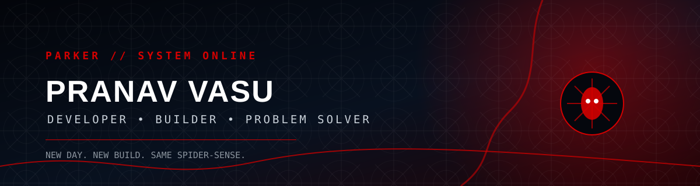

<div align="center">



[](https://github.com/pranav11-072)
[](https://github.com/pranav11-072)

</div>

<br>

## 🕷️ SPIDER-SENSE // PROFILE SCAN

```text
┌─────────────────────────────────────────────────────────────┐
│ PARKER SYSTEM                                               │
├─────────────────────────────────────────────────────────────┤
│ STATUS       ONLINE                                         │
│ OPERATOR     PRANAV VASU K                                  │
│ BASE         BENGALURU / INDIA                              │
│ ROLE         DEVELOPER • BUILDER                            │
│ MODE         LEARN → BUILD → BREAK → FIX → SHIP             │
│ CURRENT ARC  BRAND NEW DAY                                  │
└─────────────────────────────────────────────────────────────┘
```

I build practical software, experiment with AI, solve problems in C++, and turn hackathon ideas into working products.

**Currently:** `C++` `DSA` `Web` `AI/ML` `Hackathons` `Real-world builds`

> 🕸️ *The goal isn't to write more code. It's to build better things.*

---

## 🌃 NEW YORK // AFTER DARK

<div align="center">

```text
       ╱╲        ╱╲          ╱╲        ╱╲
      ╱  ╲  🕸️  ╱  ╲   🕷️   ╱  ╲  🕸️  ╱  ╲
     ╱____╲____╱____╲_______╱____╲____╱____╲

                 NIGHT SHIFT
          CODE • BUILD • DEPLOY • REPEAT
```

**When the city sleeps, the commits begin.**

</div>

---

## 🧪 PARKER'S LAB // TECH STACK

<div align="center">


</div>

| SYSTEM | STATUS |
|---|---|
| 🧠 C++ / DSA | `ACTIVE` |
| 🌐 Web Development | `ACTIVE` |
| 🤖 AI / ML | `EXPERIMENTING` |
| 🚀 Hackathons | `HIGH ACTIVITY` |
| 🛠️ Product Building | `ALWAYS ON` |
| 🧪 New Ideas | `CLASSIFIED` |

---

## 🎯 MISSIONS // ACTIVE OBJECTIVES

### 🕷️ 01 — BUILD BETTER
`DSA → Problem Solving → Engineering`

Get sharper at fundamentals while shipping projects that actually work.

### 🧪 02 — BUILD INTELLIGENT
`AI → Web → Automation`

Explore useful AI systems rather than stopping at demos.

### ⚡ 03 — SHIP

```text
IDEA → PROTOTYPE → BUILD → BREAK → DEBUG → DEPLOY → LEARN
```

**Less waiting. More shipping.**

---

## 🧬 FIELD MISSIONS // SELECTED BUILDS

<table>
<tr>
<td width="50%">

### 🚗 DriveSafe AI
AI-focused driving safety project.

`AI` `Web` `JavaScript`

</td>
<td width="50%">

### 🪐 Exoplanet Detection
TESS light curves + BLS + CNN pipeline for exoplanet transit detection and characterisation.

`Python` `TensorFlow` `Astropy` `Streamlit`

</td>
</tr>
<tr>
<td width="50%">

### ♻️ E-Waste Classifier
Machine-learning classification of e-waste using device and physical features.

`Python` `ML`

</td>
<td width="50%">

### 🕵️ LSB Steganography
GUI tool for encoding and decoding secret text inside PNG images.

`Python` `Tkinter`

</td>
</tr>
</table>

<div align="center">

[**VIEW ALL MISSIONS →**](https://github.com/pranav11-072?tab=repositories)

</div>

---

## ⚡ SUIT / SYSTEM STATUS

```text
╔══════════════════════════════════════════════════════════════╗
║                    SPIDER-SUIT v2.026                       ║
╠══════════════════════════════════════════════════════════════╣
║  PROBLEM SOLVING       ████████████████░░░░  80%            ║
║  C++ / DSA             ███████████████░░░░░  75%            ║
║  WEB ENGINEERING       ██████████████░░░░░░  70%            ║
║  AI / ML               █████████████░░░░░░░  65%            ║
║  BUILDING              ████████████████░░░░  80%            ║
║  EXPERIMENTATION       █████████████████░░░  85%            ║
║                                                              ║
║  WEB CONNECTION        : STABLE                             ║
║  COFFEE                : REQUIRED                           ║
║  BUGS                  : DETECTED                           ║
║  RESPONSE              : DEBUGGING                          ║
╚══════════════════════════════════════════════════════════════╝
```

*Percentages are intentionally approximate — this is a developer dashboard, not a scientific measurement.*

---

## 🕸️ CONTRIBUTION WEB

<div align="center">


</div>

> Every commit is another strand. Every project adds another connection.

---

## 📊 SPIDER-SENSE // TELEMETRY

<div align="center">


</div>

---

## 🏆 TROPHY ROOM

<div align="center">


</div>

---

## 🐍 THE WEB KEEPS GROWING

<div align="center">


</div>

---

## ❤️ MJ // HUMAN CHECK

```text
╭────────────────────────────────────────────────────╮
│                                                    │
│  MJ PROTOCOL                                       │
│                                                    │
│  ✓ Touch grass                                     │
│  ✓ Leave the terminal                              │
│  ✓ Talk to people                                  │
│  ✓ Enjoy the city                                  │
│  ✓ Take the break                                  │
│  ✓ Come back with a clearer head                   │
│                                                    │
╰────────────────────────────────────────────────────╯
```

> *Even Spider-Man needs a life outside the mask.* ❤️

---

## 📓 PARKER'S LOG

```text
[LOG 001] Learn something difficult.
[LOG 002] Build something useful.
[LOG 003] Break it.
[LOG 004] Figure out why.
[LOG 005] Fix it.
[LOG 006] Ship it anyway.
[LOG 007] Start the next mission.
```

---

## 📡 COMMUNICATIONS

Have an idea? Want to collaborate? Found something broken?

**Open an issue, start a discussion, or reach out through GitHub.**

<div align="center">

[](https://github.com/pranav11-072)

</div>

---

<div align="center">

## 🕷️ FRIENDLY NEIGHBORHOOD DEVELOPER

### `PRANAV VASU K // CODE WITH PURPOSE. BUILD WITH CURIOSITY.`

🕸️ ─────────────── 🕷️ ─────────────── 🕸️

<sub>Parker System // Brand New Day // Online</sub>

<br><br>


</div>
